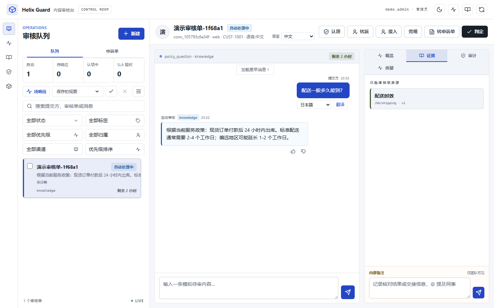
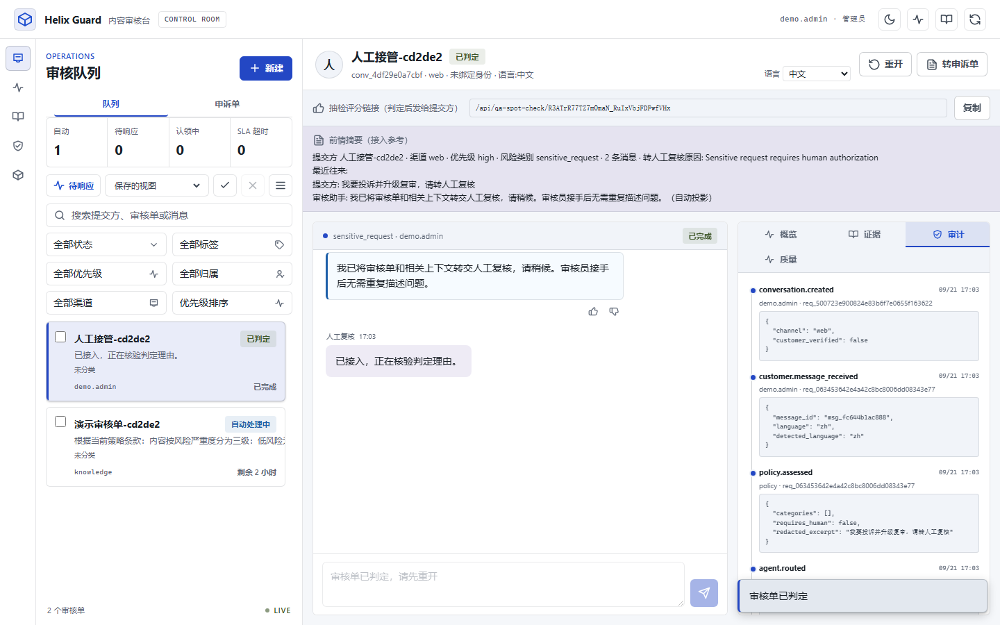
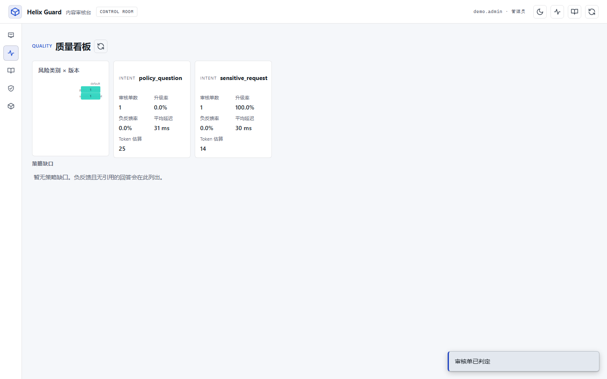
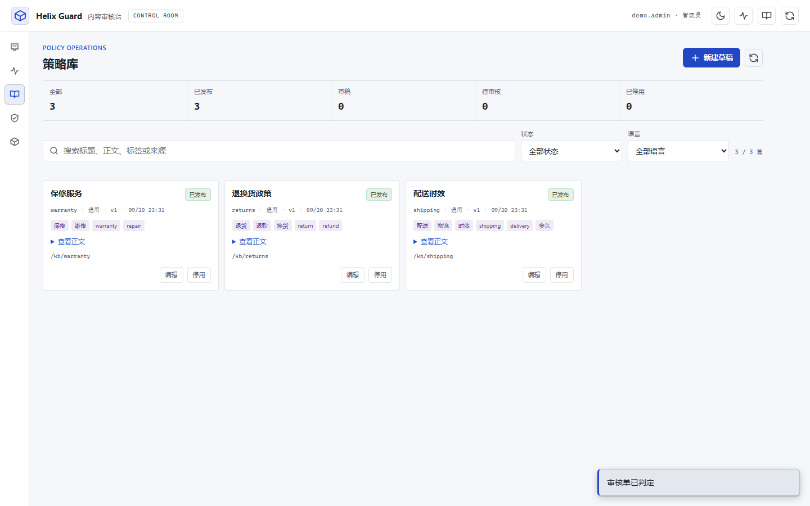
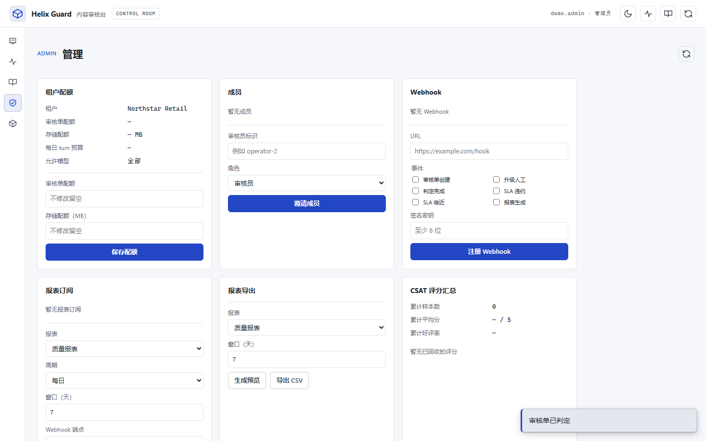
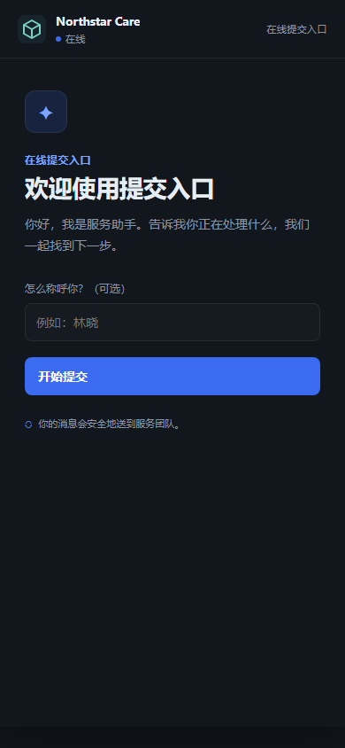
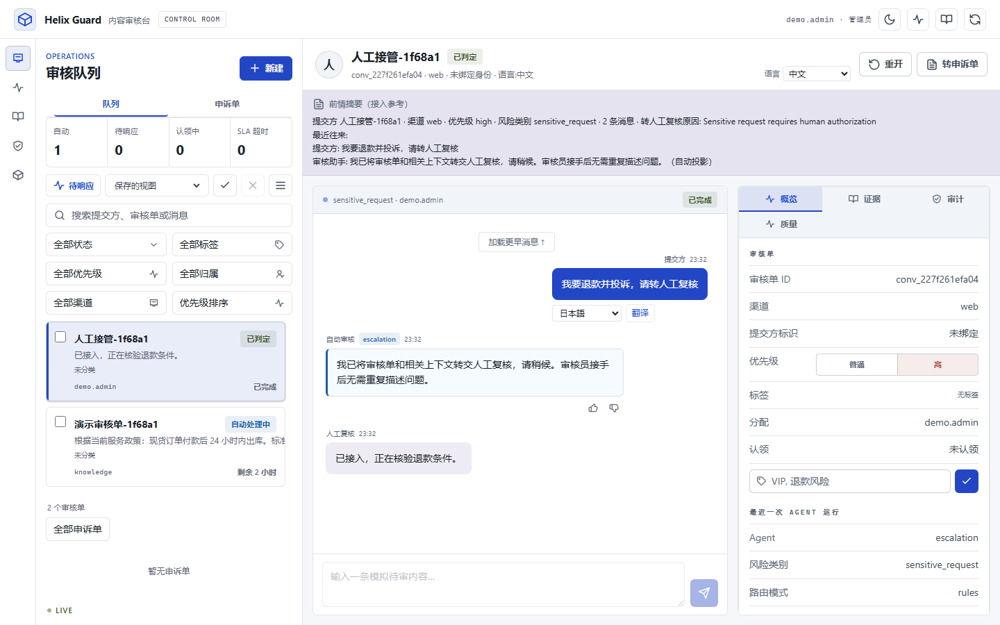
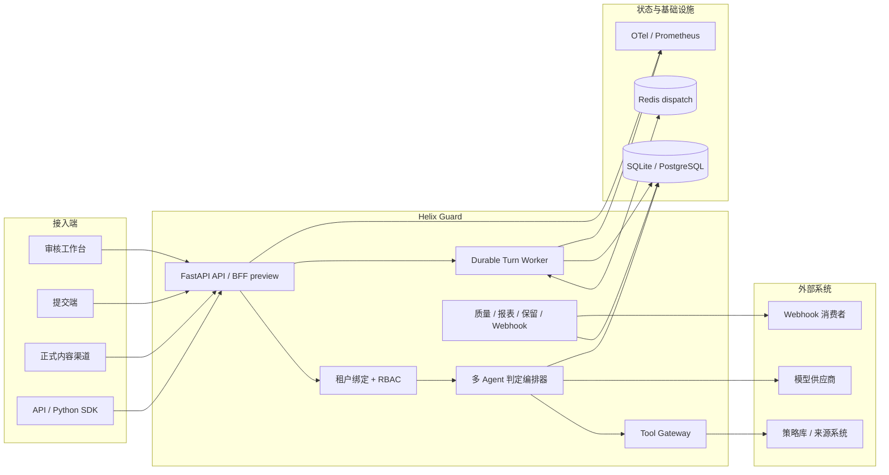
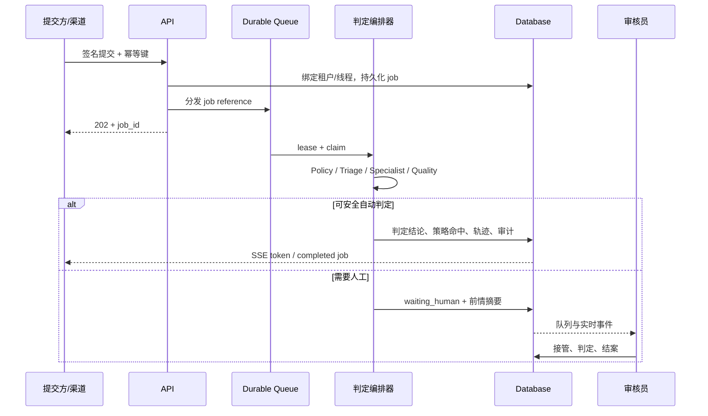

<p align="center">
  
</p>

<h1 align="center">Helix Guard</h1>

<p align="center">
  可本地运行、租户隔离、判定链路可审计的多 Agent 内容安全审核平台
</p>

<p align="center">
  <code>v2.26.0</code>&nbsp;
  <code>Python 3.11+</code>&nbsp;
  <code>FastAPI</code>&nbsp;
  <code>SQLite / PostgreSQL</code>&nbsp;
  <code>Redis</code>&nbsp;
  <code>SSE</code>&nbsp;
  <code>Zero-build frontend</code>
</p>



Helix Guard 把**内容提交、策略校验、风险分级、策略库检索、来源溯源、判定复核、人工稽核和审计取证**闭合在一个可部署系统中。没有模型密钥时使用确定性路径安全运行；接入兼容模型后可增加语义分级、多语言判定、摘要与审核员 Copilot，同时保留规则回退。审核台与可嵌入提交端采用中性板岩深色 + 单一靛蓝强调色的专业 SaaS 视觉体系，支持深/浅双主题、密度档位与低配模式。

[快速启动](#快速启动) · [界面预览](#界面预览) · [系统架构](#系统架构) · [验证与质量](#验证与质量) · [部署档位](#部署档位) · [文档导航](#文档导航)

> [!IMPORTANT]
> 默认配置面向本机演示。生产环境使用 `AUTH_MODE=api_key`、PostgreSQL 和 Redis，并按 [`DEPLOYMENT.md`](DEPLOYMENT.md) 配置 secrets、TLS、备份与可观测性。OIDC/BFF 目前属于预览能力，在 P4 数据层迁移与 M0 身份加固完成前应保持关闭。

## 产品亮点

| 能力 | 当前实现 |
| --- | --- |
| 多 Agent 判定编排 | 策略校验 → 风险分级 → 策略库 / 来源溯源 → 判定复核 → 复审升级；低置信度、高危类别和依赖故障自动转人工稽核 |
| 可信判定 | 只检索已发布策略，强制引用命中条款；来源溯源工具只读并绑定租户、提交方身份与内容标识 |
| 提交端与渠道接入 | 审核台、可嵌入提交端、provider-neutral 签名 webhook；渠道内容 ID 和外部线程持久幂等 |
| 人工协作 | 认领/接管/判定/结案/重开、内部备注与讨论线程、@提及、旁观 SSE、预置结论、申诉单和附件 |
| 平台运营 | 租户/成员/配额、策略生命周期、自动路由、处置时效、质量抽检、报表与 webhook 管理 |
| 生产导向基础 | SQLite/PG 双后端、Redis durable queue、本地审计哈希链/冷热归档、保留/DSR、SLO/DR、SBOM 与发布门禁 |
| **桌面应用（v1.4.0-desktop）** | Tauri 2.x 原生壳：Python sidecar 动态端口编排、崩溃自愈、单实例锁、启动遥测、Splash 屏、xterm.js 诊断终端；React 渐进式岛迁移双轨架构；NSIS 安装器 + 自动更新 |

## 桌面应用（v1.4.0-desktop）

基于 [Tauri 2.x](https://tauri.app/) 的原生桌面壳，替代浏览器启动流程：

- **双击图标 → 工作区可交互 < 3 秒**：窗口先行创建 + Splash 屏，后端 sidecar 在后台并行启动
- **PyInstaller onedir 打包**：后端编译为 `helix-server.exe`（~48MB），CI 冒烟测试验证 spawn → health → kill 全流程
- **Sidecar 产品化**：动态端口分配、就绪探测退避（200ms→2s）、优雅停机、崩溃自愈（≤3 次/分钟）、单实例锁
- **启动遥测**：三时间戳（t_window_created / t_backend_ready / t_ui_ready）写入 `%APPDATA%/HelixGuard/telemetry/startup.json`
- **xterm.js 内置终端**：底部抽屉（Ctrl+` 呼出），白名单诊断命令（健康检查/迁移状态/日志），DEBUG 构建启用交互式 PTY
- **React 渐进式岛迁移**：Vite + React 19 + Zustand v5 + TanStack Query v5；8 个业务岛（quality/knowledge/ticket/queue/composer/inspector/command-palette/session-shell）渐进替换 legacy 渲染，六道门禁全程保持绿色

构建桌面包：

```bash
# 1. 打包 Python sidecar
artifacts/rls-venv/Scripts/python.exe -m PyInstaller desktop/helix-server.spec --noconfirm
# 2. 拷贝到 Tauri 资源目录
cp -r desktop/dist/helix-server src-tauri/resources/server/
# 3. 构建 Vite React 岛产物
cd frontend && npm install && npx vite build
# 4. 构建 Tauri NSIS 安装器
cd ../src-tauri && cargo tauri build
```

详见 [`DEPLOYMENT_DESKTOP.md`](DEPLOYMENT_DESKTOP.md)。

## 界面预览

> 截图为 v1.4.0 专业 SaaS 主题（三层 @layer 设计令牌 + 动效令牌；中性板岩浅色 + 靛蓝强调色，默认主题）。审核台支持深/浅双主题切换。可通过 `scripts/readme_screenshots.py` 对 clean-DB 本地服务重新捕获（七张，含桌面壳）。

### 人工稽核与质量洞察

<table>
  <tr>
    <td width="50%" valign="top">
      
      <br><strong>转人工稽核</strong><br>自动生成前情摘要，接管后机审判定静默，审核员处置与审计信息在同一上下文中完成。
    </td>
    <td width="50%" valign="top">
      
      <br><strong>质量看板</strong><br>按日期、风险类别与提示词版本观察升级率、负反馈、延迟和策略缺口。
    </td>
  </tr>
</table>

### 策略运营与租户管理

<table>
  <tr>
    <td width="50%" valign="top">
      
      <br><strong>策略运营</strong><br>草稿、审核、发布、停用完整生命周期；只读角色只看到已发布条款。
    </td>
    <td width="50%" valign="top">
      
      <br><strong>租户管理</strong><br>配额、成员角色、Webhook、报表订阅/导出和抽检汇总集中管理。
    </td>
  </tr>
</table>

### 可嵌入提交端

<p align="center">
  
</p>

提交端使用短期签名 bootstrap token 换取审核单绑定 token，以带认证的 fetch-SSE 流式接收判定结果；支持品牌名、主题色、语言、刷新恢复和转人工复核稽核状态。

### 桌面壳（Tauri）

<p align="center">
  
</p>

桌面应用（v1.4.0-desktop）以 Tauri 2.x 原生壳启动同一控制台：React 岛接管队列、编排器与检查器渲染（D3 双轨迁移），Python sidecar 动态端口后台启动，构建与发布细节见 [`DEPLOYMENT_DESKTOP.md`](DEPLOYMENT_DESKTOP.md)。

## 系统架构



### 一条内容如何完成判定



## 已实现能力

<details open>
<summary><strong>审核单与审核员工作流</strong></summary>

- 队列分页/游标、全文搜索、标签、优先级、虚拟列表和多窗口同步
- 审核单状态机、处置时效、软认领/续租、接管、人工判定、结案与重开
- 内部备注、讨论线程、@提及、旁观 SSE、预置结论、申诉化和抽检评分
- 多语言检测/翻译、内容摘要、策略推荐、判定建议和语气改写

</details>

<details>
<summary><strong>策略、质量与自动化</strong></summary>

- 发布态策略检索、版本/审批/停用、负反馈回流与策略缺口
- Prompt/模型注册、稳定 canary 分桶、租户模型策略/预算和故障切换
- Golden Set 离线评测、质量趋势、风险类别×版本对比、抽检评分和报表订阅/导出
- 自动路由、审核组容量、处置时效预警/超期、出站 Webhook 与 DLQ

</details>

<details>
<summary><strong>安全、数据与可靠性</strong></summary>

- API key 租户绑定、细粒度权限、吊销、速率限制、CSRF/CSP/安全响应头
- 渠道 HMAC、时间窗重放防护、线程/内容持久幂等、统一 Problem Details
- 审计哈希链、可校验冷热归档、数据保留、PII 脱敏、数据主体导出/删除基础
- PostgreSQL/SQLite 迁移等价、Redis 租约队列、背压、恢复、优雅关闭和混沌测试

</details>

<details>
<summary><strong>平台化与企业治理（2.x）</strong></summary>

- AI 成本归因：每次推理记录 token 用量与 USD 成本（供应商定价），按租户/日期/agent/提示版本聚合，管理端成本仪表盘含异常检测
- 线上 drift 监控：质量、拒绝计数、成本因子、引用失效四类信号越限自动停 canary 并审计
- v1→v2 影子流量：按采样率把 v1 读请求重放到 v2 端点做字段级对比，24 小时健康窗口自动告警
- 多 cell：注册表驱动的 cell 路由、跨区异步复制（内部认证入口）、受控区域故障切换 runbook
- 数据面/控制面：HMAC 签名租户策略快照、LKG 降级、restricted 字段信封加密、外部审计锚定（Ed25519 + WORM）
- AI 治理注册表：工具启用 maker-checker 审批、线上负反馈自动脱敏入册与评审/晋级、评测运行 WORM 报告、capability token 工具授权
- 租户开通即发布初始控制面策略：版本化 tenant_control_policies 幂等写入，故障切换 runbook 前置有生产路径
- SDK v2：游标分页、Idempotency-Key 重放语义与跨版本一致性测试（clients/python）；提交端抽检：判定后横幅 + 一次性评分链接跨面闭环

</details>

## 快速启动

### Windows / PowerShell

```powershell
Set-Location -LiteralPath 'C:\path\to\agent1'
python -m venv .venv
.\.venv\Scripts\Activate.ps1
python -m pip install -e .
powershell.exe -NoLogo -NoProfile -NonInteractive -File .\scripts\start_local.ps1 -PreferredPort 8000
```

脚本会输出包含 `pid`、`port`、`url` 和 `ready=true` 的 JSON；端口被占用时自动尝试下一个端口。请打开输出中的实际 `url`，不要假定端口始终为 8000。停止服务：`Stop-Process -Id <输出的 pid>`。

### macOS / Linux

```bash
cd /path/to/agent1
python3 -m venv .venv
source .venv/bin/activate
python3 -m pip install -e .
python3 -m uvicorn app.main:app --host 127.0.0.1 --port 8000
```

打开 `http://127.0.0.1:8000`，并用 `curl http://127.0.0.1:8000/health/ready` 验证 `status=ready`；前台进程用 `Ctrl+C` 停止。默认 `AUTH_MODE=demo` 仅用于本机体验。推荐演示数据：提交方 `林嘉`、提交方标识 `CUST-1001`、来源记录 `ORD-10482`。

### 常用生产配置

| 配置 | 用途 |
| --- | --- |
| `APP_ENV=production`、`AUTH_MODE=api_key` | 启用生产配置校验和 API key 身份 |
| `API_KEYS_FILE` | gitignored/secret-manager 挂载的租户 principal 配置 |
| `DATABASE_BACKEND=postgresql`、`DATABASE_URL` | 多实例共享 PostgreSQL |
| `QUEUE_BACKEND=redis`、`REDIS_URL` | 跨实例 turn-job 分发与租约 |
| `CHANNEL_WEBHOOKS_FILE` | 正式入站渠道账号→租户/渠道/HMAC secret 映射 |
| `WIDGET_SECRET`、`WIDGET_FRAME_ANCESTORS` | 提交端 token 和允许嵌入的父页面 origin |
| `ENABLE_LLM`、`OPENAI_API_KEY`、`OPENAI_BASE_URL`、`OPENAI_MODEL` | 可选 OpenAI-compatible 模型路由；未配置时保留确定性路径 |
| `ENABLE_TELEMETRY`、`OTEL_EXPORTER_OTLP_ENDPOINT` | OpenTelemetry trace 导出 |

完整配置、PostgreSQL 调优、迁移、备份和生产边界见 [`DEPLOYMENT.md`](DEPLOYMENT.md)。

## API 与集成

- 交互式文档：运行后访问 `/docs`（生产可关闭）
- 静态参考：[`docs/api/reference.md`](docs/api/reference.md)
- 集成指南：[`docs/api/guide.md`](docs/api/guide.md)
- OpenAPI snapshot：[`api/openapi.json`](api/openapi.json)
- Python SDK：[`clients/python/`](clients/python/)
- 错误契约：[`docs/ERRORS.md`](docs/ERRORS.md)

正式渠道入口为 `POST /api/channels/{account_id}/webhook`；签名输入是原始 `<timestamp>.<body>`。未知账号、错误签名和过期时间统一拒绝，重放相同 `message_id` 返回原 job。

## 验证与质量

当前完整验证基线（2026-08-24，含 v1.3.9 专业 SaaS 视觉重做后的全门禁复验；证据见 [`CHANGELOG.md`](CHANGELOG.md)）：

| Gate | 最近证据 |
| --- | ---: |
| Python tests | 723 passed + 50 subtests |
| Branch coverage | 85% |
| PostgreSQL integration | 73 passed + 3 subtests |
| Redis integration | 9 passed |
| Frontend Node tests | 155 passed |
| Golden Set | 27 / 27 |
| Browser acceptance | 审核台、管理、策略、提交端、移动与 axe 全绿 |
| 视觉回归 | 四基线 clean DB 重引导，0.00% 像素漂移（±12 容差、0.5% 上限） |
| 前端性能预算 | CSS 84 KB（预算 105 KB）、LCP 356 ms、CLS 0.0019、10k 队列渲染 10 ms |
| 供应链 | project/lock pip-audit、npm audit 0 漏洞；SBOM、wheel/sdist 通过 |

v1.3.9 视觉重做推翻了此前的 Art Deco 黑金主题，重建中性板岩深色 + 单一靛蓝强调色的专业 SaaS 体系：去金色装饰与仿金属光晕、恢复标准圆角与实色投影、系统字体栈替代 Google Fonts 依赖（CSP 同步收紧）、控件现代化与空状态引导感改造。accent 色分离 `--teal`（按钮实色，白字 ≥4.5:1）与 `--teal-bright`（文字/图标，深底 ≥4.5:1）双 token，双主题 axe 对比度全绿。视觉四基线随重做重新引导。

开发时常用门禁：

```powershell
python -m ruff format --check app tests scripts
python -m ruff check app tests scripts
python -m pyright app tests scripts
python -m coverage run --branch -m pytest tests -q
python -m coverage report --fail-under=85
python scripts\openapi_snapshot.py
python scripts\frontend_gate.py
python scripts\migration_gate.py
python -m pip_audit .
python -m pip_audit -r requirements.lock
npm audit --audit-level=high
```

真实 PostgreSQL/Redis、浏览器、迁移、构建和发布命令见 [`CONTRIBUTING.md`](CONTRIBUTING.md) 与 [`docs/RELEASE_CHECKLIST.md`](docs/RELEASE_CHECKLIST.md)。

## 部署档位

| 档位 | 数据库 / 队列 | 适用范围 | 约束 |
| --- | --- | --- | --- |
| Local demo | SQLite / SQLite | 本地体验、开发、单元测试 | `AUTH_MODE=demo`，不可公网暴露 |
| Single-node | SQLite / SQLite | 小规模受控单机 | 必须备份；不能多实例共享 SQLite |
| Production multi-instance | PostgreSQL / Redis | 正式商用、横向扩展 | secrets、TLS、备份/PITR、OTel、SLO/告警必须配置 |
| Staging | PostgreSQL / Redis / OTel | 发布、迁移、故障与容量演练 | 使用 [`compose.staging.yaml`](compose.staging.yaml) 或等价托管环境 |

容量基线已覆盖 10 万审核单/百万内容搜索、500 SSE 连接、50 并发活跃审核单和双实例滚动重启；详细环境与边界见 [`docs/CAPACITY.md`](docs/CAPACITY.md)。

## 项目结构

```text
app/                  FastAPI 应用、判定 Agent、队列、迁移与静态界面
  db/                 按领域拆分的数据访问 mixin
  routers/            按领域拆分的 API router
  static/             零构建审核台与提交端
api/openapi.json      受 CI 保护的 API 契约快照
clients/python/       Python SDK
docs/                 ADR、API、运维、安全、容量与用户手册
golden/               离线质量回归集
ops/                  Prometheus、Grafana、OTel 配置
scripts/              迁移、备份、容量、SBOM 与发布工具
tests/                后端、前端、PG/Redis 和 Playwright 验收
```

## 文档导航

| 主题 | 文档 |
| --- | --- |
| 领域术语契约 | [`docs/DOMAIN.md`](docs/DOMAIN.md) |
| 业务域迁移方案 | [`docs/DOMAIN_MIGRATION_PLAN.md`](docs/DOMAIN_MIGRATION_PLAN.md) |
| 架构决策 | [`docs/adr/`](docs/adr/README.md) |
| 部署与配置 | [`DEPLOYMENT.md`](DEPLOYMENT.md) · [`DEPLOYMENT_DESKTOP.md`](DEPLOYMENT_DESKTOP.md) |
| 日常运维与故障处置 | [`docs/OPERATIONS.md`](docs/OPERATIONS.md) · [`docs/TROUBLESHOOTING.md`](docs/TROUBLESHOOTING.md) |
| SLO、降级与灾备 | [`docs/SLO.md`](docs/SLO.md) · [`docs/DEGRADATION.md`](docs/DEGRADATION.md) · [`docs/DISASTER_RECOVERY.md`](docs/DISASTER_RECOVERY.md) |
| 安全模型与报告 | [`docs/SECURITY_MODEL.md`](docs/SECURITY_MODEL.md) · [`SECURITY.md`](SECURITY.md) |
| API 策略与错误 | [`docs/API_POLICY.md`](docs/API_POLICY.md) · [`docs/ERRORS.md`](docs/ERRORS.md) |
| 容量与性能 | [`docs/CAPACITY.md`](docs/CAPACITY.md) · [`docs/PERF_NOTES.md`](docs/PERF_NOTES.md) |
| 审核与租户手册 | [`docs/guides/operator-manual.md`](docs/guides/operator-manual.md) · [`docs/guides/tenant-admin-manual.md`](docs/guides/tenant-admin-manual.md) |
| 变更历史 | [`CHANGELOG.md`](CHANGELOG.md) |
| README 截图重捕获 | `HELIX_BASE_URL=http://127.0.0.1:8766 python scripts/readme_screenshots.py`（对 clean-DB 服务，覆盖 `docs/assets/screenshots/`，七张含桌面壳） |

> [!NOTE]
> **域迁移进行中**：本产品原定位为多 Agent 智能客服平台，正在迁移到内容安全审核领域。产品名、README 叙事、术语契约（[`docs/DOMAIN.md`](docs/DOMAIN.md)）、**用户可见文案**（P1–P2，2.23.0/2.24.0）、**内容夹具**（P2b，2.25.0：种子策略正文、来源记录状态串、`golden/*` 评测集）与**模块名与 API 路径**（P3a，2.26.0：`tickets→appeals`、`csat→qa_spot_check`、`knowledge→policy`、`widget→submission_portal` 等 T4/T6–T9/T12/T13 面，旧路径经弃用窗口继续服务）已更新；审核单（T5 `conversation`）、数据库对象与测试/基线仍按 [`docs/DOMAIN_MIGRATION_PLAN.md`](docs/DOMAIN_MIGRATION_PLAN.md) 的阶段 P3b–P5 推进。当前 `conversation` / `ticket` 一类**代码标识符与表名**仍是旧域命名，属预期中间态。

## 安全与生产边界

发现漏洞时不要在公开 issue 中提交 exploit 或提交方数据。[`SECURITY.md`](SECURITY.md) 定义报告字段与响应 SLA，但仓库中的邮箱是部署占位符；任何外部环境必须先配置并演练真实私有接收渠道，才能对外发布安全报告地址。

| 当前已知边界 | 上线前临时控制 | 正式整改 |
| --- | --- | --- |
| OIDC/BFF 尚缺完整 transaction/JWKS/claims 验证 | `ENABLE_SESSION_AUTH=false`，生产继续 API key | M0 SEC-001 |
| DSR 执行当前使用 `operator:act` | 限制路由可达性，只允许管理员操作并巡检审计 | M0 SEC-002 |
| 多实例 Redis 连接失败会回退本地 SQLite queue | 启动探针核对实际 backend；Redis 故障时停止实例/发布 | M0 REL-001 |
| 审计链和 anchor 位于本地数据边界 | 定期离站保存可校验 manifest/链头 | 1.4 SEC-005 |
| 正式渠道是通用签名 webhook 模板 | 上线前完成 provider sandbox 与重放/轮换演练 | 1.5 Adapter SDK |

当前仓库提供生产导向的软件基线，但不等同于托管服务、合规认证或主动-主动多区域平台。正式上线前必须完成真实身份源、secret manager、TLS/网络边界、PostgreSQL/Redis 高可用、加密备份/PITR、集中可观测性、告警值班和恢复演练。

版本历史和行为变更见 [`CHANGELOG.md`](CHANGELOG.md)。
